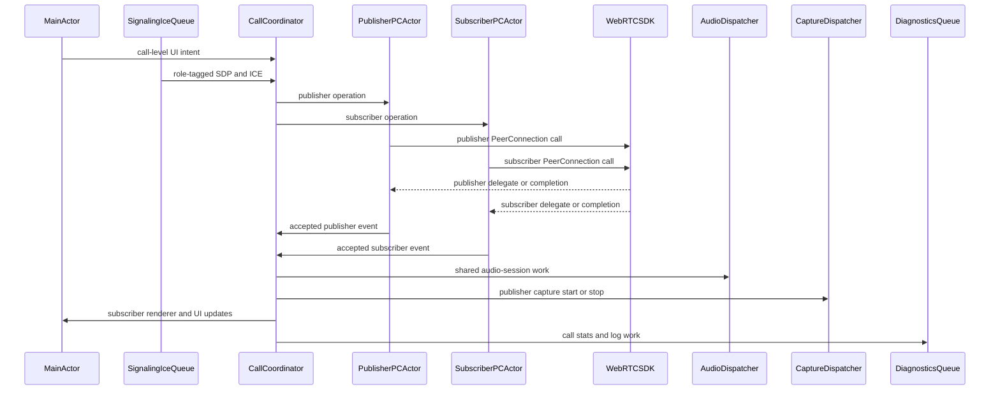

# Best Practices

## Threading

WebRTC public API calls are designed around a single client thread, but callbacks
and observer events are not guaranteed to arrive on that thread.

Default stance:

- Treat every WebRTC delegate/completion callback as non-main-thread.
- Dispatch UI changes to the main queue.
- Avoid calling WebRTC APIs directly from callbacks when reentrancy or thread ownership is unclear; schedule work onto the app's client queue.
- Use `RTCDispatcher` queues for shared platform resources: main, capture session, audio session, and network monitor.

`ARDAppClient` comments explicitly note that `RTCPeerConnectionDelegate` and SDP
callbacks occur on non-main threads and dispatch to main as needed.

## Threading Architecture

Recommended app shape:

- In a publisher/subscriber architecture, use one call coordinator plus one
  serialized Swift actor or queue per `RTCPeerConnection`.
- Keep publisher and subscriber PeerConnection state separate. Publisher SDP/ICE,
  local senders, camera, and bitrate changes should not serialize behind
  subscriber SDP/ICE or remote-renderer state unless a call-level transition
  requires it.
- Keep signaling and ICE ingestion separate when backend callbacks, network
  retries, candidate buffering, or persistence could block call state.
- Apply SDP before queued ICE candidates; preserve signaling order at the app
  boundary.
- Use Swift `.typeAudioSession` (`RTCDispatcherTypeAudioSession`) for
  audio-session configuration, route overrides, and CallKit handoffs into the
  audio coordinator.
- Keep video capture on capture/session queues and render view ownership on main.
- Put stats polling, file logs, uploads, and diagnostics formatting on a
  diagnostics queue.
- Keep WebRTC callbacks, AudioEngine observer callbacks, audio callbacks, render
  callbacks, and logging callbacks fast; hop before touching product state or
  calling WebRTC again.

Do not expose WebRTC's internal signaling/worker/network threads as app
architecture. The app owns ordering at its API boundary; WebRTC handles its
internal dispatch after calls enter the Obj-C API.

For Swift, prefer an actor for product state and a small queue wrapper when an
SDK call must happen from a specific GCD queue. WebRTC Obj-C objects are not
documented as `Sendable`; keep ownership on the relevant call or PeerConnection
actor and pass simple values across concurrency boundaries.

```swift
actor PeerConnectionSession {
    private let peerConnection: RTCPeerConnection

    func applyRemoteDescription(_ sdp: RTCSessionDescription) async throws {
        try await withCheckedThrowingContinuation { (continuation: CheckedContinuation<Void, Error>) in
            peerConnection.setRemoteDescription(sdp) { error in
                if let error {
                    continuation.resume(throwing: error)
                } else {
                    continuation.resume()
                }
            }
        }
    }
}
```

Use a call-level coordinator for shared policy:

```swift
actor CallSession {
    private let publisher: PeerConnectionSession
    private let subscriber: PeerConnectionSession
    private let audioCoordinator: AudioCoordinator

    func handleRemoteCandidate(_ candidate: RTCIceCandidate, role: PeerConnectionRole) async {
        switch role {
        case .publisher:
            await publisher.handleRemoteCandidate(candidate)
        case .subscriber:
            await subscriber.handleRemoteCandidate(candidate)
        }
    }

    func setSpeakerEnabled(_ enabled: Bool) {
        audioCoordinator.setSpeakerEnabled(enabled)
    }
}
```

Use `MainActor` only for UI, renderer view ownership, and view-model state:

```swift
Task { @MainActor in
    remoteVideoTrack.add(renderer)
}
```

For WebRTC dispatcher queues from Swift:

```swift
RTCDispatcher.dispatchAsync(on: .typeAudioSession, block: {
    // RTCAudioSession work
})

RTCDispatcher.dispatchAsync(on: .typeCaptureSession, block: {
    // AVCaptureSession start/stop or preview-session assignment
})
```

If the imported enum cases differ in a fork, inspect the generated WebRTC module
interface. The Obj-C source names are `RTCDispatcherTypeAudioSession` and
`RTCDispatcherTypeCaptureSession`.

Minimal flow:



1. `MainActor` handles UI intent and renderer/view-model ownership.
2. The signaling/ICE queue receives backend messages and preserves SDP-before-ICE
   ordering per PeerConnection role.
3. The call coordinator routes role-tagged work to the publisher or subscriber
   PeerConnection actor.
4. Each PeerConnection actor owns one `RTCPeerConnection` and serializes its own
   SDP, ICE, transceiver, sender/receiver, and cleanup state.
5. WebRTC delegates and completions immediately hop back to the matching
   PeerConnection actor before touching app state or calling WebRTC again.
6. The call coordinator routes shared platform work to the right owner:
   - audio policy: `RTCDispatcher.dispatchAsync(on: .typeAudioSession, block:)`
     into the audio coordinator
   - capture start/stop: `RTCDispatcher.dispatchAsync(on: .typeCaptureSession,
     block:)` into the capture owner
   - UI updates: `MainActor`
   - stats/log formatting: diagnostics queue

PeerConnection-state decisions are the small checks and mutations that keep one
`RTCPeerConnection` lifecycle coherent. Keep these serialized per role; do not
make publisher ICE wait behind subscriber rendering, and do not keep an actor
occupied while unrelated platform work runs.

Examples:

| Event | Owner decides | Downstream owner does |
| --- | --- | --- |
| Publisher SDP arrives | Publisher PC actor checks call generation, signaling state, and queued publisher ICE. | Publisher `RTCPeerConnection` applies SDP. |
| Subscriber ICE arrives | Subscriber PC actor checks remote SDP and queues/drops/applies the candidate. | Subscriber `RTCPeerConnection` applies ICE when allowed. |
| User toggles speaker | Call coordinator checks call activity and records desired shared route state. | Audio dispatcher performs `RTCAudioSession` locking and route override. |
| User starts camera | Call coordinator or publisher PC actor checks publish state and whether capture is already running. | Capture dispatcher starts/stops `AVCaptureSession`. |
| Remote video track arrives | Subscriber PC actor accepts the receiver/transceiver event if current. | MainActor attaches renderer or updates UI. |
| Hangup starts | Call coordinator marks call closed; publisher and subscriber actors invalidate pending operation tokens. | Audio, capture, diagnostics, UI, and both PeerConnections clean up on their owners. |
| WebRTC callback fires | Matching PC actor checks role, generation, and closed state. | UI/audio/diagnostics update only after the actor accepts the event. |

Pattern:

```swift
actor PeerConnectionSession {
    private let role: PeerConnectionRole
    private let peerConnection: RTCPeerConnection
    private var isClosed = false
    private var hasRemoteDescription = false
    private var pendingCandidates: [RTCIceCandidate] = []

    func handleRemoteCandidate(_ candidate: RTCIceCandidate) {
        guard !isClosed else { return }
        guard hasRemoteDescription else {
            pendingCandidates.append(candidate)
            return
        }
        peerConnection.add(candidate) { [weak self] error in
            Task { await self?.handleCandidateResult(error) }
        }
    }
}

actor CallSession {
    private let publisher: PeerConnectionSession
    private let subscriber: PeerConnectionSession
    private let audioCoordinator: AudioCoordinator
    private var isClosed = false
    private var desiredSpeakerEnabled = false

    func setSpeakerEnabled(_ enabled: Bool) {
        guard !isClosed else { return }
        desiredSpeakerEnabled = enabled
        audioCoordinator.setSpeakerEnabled(enabled)
    }
}
```

Timing risks:

- Reentrant WebRTC calls from callbacks can deadlock or race with internal proxy
  dispatch.
- Blocking a callback can delay signaling, media state, or logging paths.
- Dispatching SDP and ICE through different queues without an ordering gate can
  apply candidates before the remote description.
- Hangup must invalidate queued callbacks so stale completions do not resurrect
  closed call state.
- Audio/session callbacks can race with CallKit and route changes; centralize
  them in one audio coordinator.

## Swift Bridging

When advising Swift callers:

- Wrap callback APIs with `async` functions at app boundaries, not inside WebRTC internals.
- Resume continuations exactly once from completion handlers.
- Use `@MainActor` only for UI state, renderer ownership, and view-model updates.
- Keep PeerConnection operations serialized through a call/session actor or queue.
- Do not assume WebRTC objects are `Sendable`.
- Avoid holding `RTCAudioBuffer` beyond the audio processing callback; its valid scope is only inside the callback.
- Prefer Swift snippets in user-facing answers, with Obj-C selector names only when explaining the underlying SDK header.

For delegate methods, bridge into Swift state like:

- Receive callback.
- Hop to the session actor/queue for call state.
- Hop to `MainActor` for UI only.

## Lifecycle and Ownership

Prefer explicit ownership:

- Call/session object owns `RTCPeerConnection`, local tracks, capturers, diagnostics, signaling channel, and timers.
- View/controller owns render views and attaches/detaches renderers.
- Audio coordinator owns `RTCAudioSession` policy and CallKit interactions.
- Signaling adapter owns backend message transport and hands ordered SDP/ICE work to the call queue.

Avoid retain cycles:

- Use weak self in timers and async completion handlers.
- Invalidate timers before releasing.
- Remove renderers before replacing tracks.

Cleanup should be idempotent.

## Unified Plan

Use Unified Plan for new work:

- `RTCConfiguration.sdpSemantics = RTCSdpSemanticsUnifiedPlan`
- `addTrack:streamIds:` or transceiver APIs.
- `transceivers`, `senders`, and `receivers` for media.
- `didAddReceiver` and `didStartReceivingOnTransceiver` for remote media.

Avoid deprecated Plan B paths in new integrations:

- `addStream`
- `removeStream`
- `senderWithKind:streamId:`
- stream-only remote media callbacks as the primary design.

## Codec Selection

Default factories:

- `RTCDefaultVideoEncoderFactory`
- `RTCDefaultVideoDecoderFactory`

`RTCDefaultVideoEncoderFactory` exposes `supportedCodecs` and `preferredCodec`.
AppRTCMobile sets `preferredCodec` from settings before creating the factory.

If using custom codecs, implement custom `RTCVideoEncoderFactory` and
`RTCVideoDecoderFactory`.

Do not force codecs by SDP string surgery unless there is no supported API for
the required behavior and the tradeoff is explicit.

## Fork-Specific Rendering Tuning

If `RTCPeerConnectionFactory+Stream.h` is available, `frameBufferPolicy` can tune
decoded frame buffer bridging.

Best practice:

- Set it before call start when possible.
- Keep one owner responsible for changing it.
- Expect mixed frame formats if it changes mid-call.
- Treat NV12 conversion/copy policies as performance-sensitive; profile before assuming they help.
- Fall back to default behavior if renderer or conversion paths fail.

## RTP and Bitrate Tuning

Use sender parameters for send-side tuning:

- Read `sender.parameters`.
- Modify `RTCRtpEncodingParameters` entries.
- Set `maxBitrateBps`, `minBitrateBps`, `maxFramerate`, `numTemporalLayers`, `scaleResolutionDownBy`, `scalabilityMode`, or `isActive` as needed.
- Assign back through `setParameters:`.

`ARDAppClient` sets max video bitrate by iterating senders, finding the video
sender, and updating each encoding's `maxBitrateBps`.

Use `setBweMinBitrateBps:currentBitrateBps:maxBitrateBps:` only when global BWE
control is truly needed and values are sane; tests assert invalid ranges fail.

## Field Trials and Metrics

Field trials and metrics are process-level concerns:

- `RTCInitFieldTrialDictionary` must be called before any other WebRTC call and is deprecated in favor of passing field trials when building `RTCPeerConnectionFactory`.
- `RTCEnableMetrics` must be called before any other WebRTC call.
- `RTCGetAndResetMetrics` gets and clears native histograms.

Do not scatter these calls through feature code. Centralize initialization.

## Fork-Specific Audio Controls

If `RTCAudioDeviceModuleTypeAudioEngine` is available, use it only for products
that need AVAudioEngine-level behavior.

Best practice:

- Keep device selection and engine policy in one audio coordinator.
- Test voice processing, AGC, mute mode, stereo playout, ducking, interruptions, and route changes on hardware.
- Remember that `prefersStereoPlayout` disables voice processing while enabled.
- Prefer observer callbacks for engine lifecycle integration instead of reaching into internal audio objects.
- Do not rely on AudioEngine device lists for production iOS route selection; use `RTCAudioSession`/`AVAudioSession` route policy.

## Data Channels

Use `RTCDataChannelConfiguration` deliberately:

- `isOrdered`: ordered delivery.
- `maxPacketLifeTime`: time-limited unreliable delivery.
- `maxRetransmits`: retransmission-limited unreliable delivery.
- `isNegotiated` and `channelId`: externally negotiated channels.
- `protocol`: app-defined sub-protocol.

Send with `RTCDataBuffer` and observe `readyState` and `bufferedAmount`.

Backpressure matters: do not enqueue unbounded app data when `bufferedAmount`
grows.

## Security and Privacy

Use WebRTC defaults unless product security requirements say otherwise.

Relevant types:

- `RTCCertificate`: generated or provided DTLS certificate material.
- `RTCCryptoOptions`: SRTP crypto suites, encrypted RTP header extensions, and SFrame requirement.
- `RTCFrameCryptor` and `RTCFrameCryptorKeyProvider`: frame-level encryption for senders/receivers.

Be careful with:

- `srtpEnableAes128Sha1_32CryptoCipher`: header notes call it potentially insecure.
- `sframeRequireFrameEncryption`: senders/receivers must have frame encryptors/decryptors attached before packets can be sent/received.
- Persisting private key material from `RTCCertificate`.
- Logging SDP, ICE candidates, TURN credentials, room IDs, device details, or user identifiers.

## Permissions

The app owns permission flow and privacy copy. Before starting capture:

- Check/request camera permission.
- Check/request microphone permission.
- Ensure Info.plist strings match product language.

Do not start capture first and rely on implicit system behavior.

## Error Handling

Never ignore completion-handler errors from:

- SDP creation.
- Setting local/remote descriptions.
- Adding ICE candidates.
- Starting capture.
- Configuring audio session.
- Starting diagnostics.

Map errors into product call state and logs. Close or retry according to explicit
product policy.
