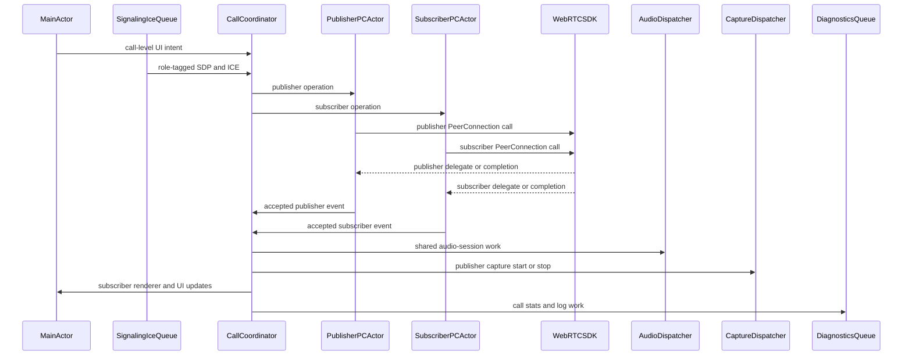

# Swift Threading and Ownership

Use this reference when the task involves Swift concurrency, actors, queues,
delegate callback ordering, publisher/subscriber separation, or races around
hangup, SDP, ICE, audio, capture, rendering, or diagnostics.

## Default Model

WebRTC public API calls are app-entered, but delegate, completion, observer,
audio, render, and logging callbacks are not UI callbacks.

Use this shape for production Swift apps:

- `MainActor`: UI intent, renderer view ownership, and view-model state.
- Signaling/ICE queue: backend messages, retries, buffering, and ordered
  SDP-before-ICE ingestion.
- Call coordinator actor: call-level lifecycle, generation tokens, shared policy,
  and routing to per-connection owners.
- One `PeerConnectionSession` actor or serial queue per `RTCPeerConnection`.
- Audio coordinator: `RTCAudioSession`, route policy, CallKit, manual audio.
- Capture owner: camera/file/broadcast capture start and stop.
- Diagnostics queue: stats polling, file logs, RTC event logs, AEC dumps, and
  uploads.

Do not expose WebRTC internal signaling, worker, or network threads as app
architecture. The app owns ordering before calls enter the Obj-C API.

## Ownership Rules

- Keep publisher and subscriber PeerConnection state separate. Publisher SDP/ICE,
  local senders, camera, and bitrate changes should not wait behind subscriber
  SDP/ICE or remote-renderer state.
- Coordinate through the call actor only for shared lifecycle or product policy:
  answer, hangup, reconnect, audio route, permissions, and diagnostics.
- Each PeerConnection owner serializes its own SDP, ICE, transceiver,
  sender/receiver, data channel, stats, and cleanup state.
- Pass simple values across actors where possible. WebRTC Obj-C objects are not
  documented as `Sendable`.
- Keep callbacks fast. Hop to the owner actor or queue before touching app state
  or calling WebRTC again.

## Dispatcher Queues

Use WebRTC dispatcher queues for platform resources:

```swift
RTCDispatcher.dispatchAsync(on: .typeAudioSession, block: {
    // RTCAudioSession configuration, route overrides, CallKit handoffs.
})

RTCDispatcher.dispatchAsync(on: .typeCaptureSession, block: {
    // AVCaptureSession start/stop or preview-session assignment.
})
```

If Swift enum cases differ in a fork, inspect the generated WebRTC module
interface. Obj-C names include `RTCDispatcherTypeAudioSession` and
`RTCDispatcherTypeCaptureSession`.

## Minimal Actor Pattern

Wrap completion-handler APIs at the app boundary. This is a shape, not drop-in
code; map errors, candidate draining, and closed-call behavior to product state.

Use a call-level coordinator for shared policy:

```swift
actor CallSession {
    private let publisher: PeerConnectionSession
    private let subscriber: PeerConnectionSession
    private let audioCoordinator: AudioCoordinator

    func handleRemoteCandidate(_ candidate: RTCIceCandidate, role: PeerConnectionRole) async {
        switch role {
        case .publisher:
            await publisher.handleRemoteCandidate(candidate)
        case .subscriber:
            await subscriber.handleRemoteCandidate(candidate)
        }
    }

    func setSpeakerEnabled(_ enabled: Bool) {
        audioCoordinator.setSpeakerEnabled(enabled)
    }
}
```

```swift
actor PeerConnectionSession {
    private let peerConnection: RTCPeerConnection
    private var isClosed = false
    private var hasRemoteDescription = false
    private var pendingCandidates: [RTCIceCandidate] = []

    func applyRemoteDescription(_ sdp: RTCSessionDescription) async throws {
        guard !isClosed else { return }

        try await withCheckedThrowingContinuation { continuation in
            peerConnection.setRemoteDescription(sdp) { error in
                if let error {
                    continuation.resume(throwing: error)
                } else {
                    continuation.resume()
                }
            }
        }

        hasRemoteDescription = true
        flushPendingCandidates()
    }

    func handleRemoteCandidate(_ candidate: RTCIceCandidate) {
        guard !isClosed else { return }
        guard hasRemoteDescription else {
            pendingCandidates.append(candidate)
            return
        }

        peerConnection.add(candidate) { [weak self] error in
            Task { await self?.handleCandidateResult(error) }
        }
    }

    private func flushPendingCandidates() {
        // Apply queued candidates in signaling order after remote SDP succeeds.
    }

    private func handleCandidateResult(_ error: Error?) {
        // Surface errors to call state/logs; do not ignore ICE failures.
    }
}
```

Hop to `MainActor` only for UI or renderer ownership:

```swift
Task { @MainActor in
    remoteVideoTrack.add(renderer)
}
```

## Dual PeerConnection Flow



1. `MainActor` handles UI intent and renderer/view-model ownership.
2. The signaling/ICE queue receives backend messages and preserves SDP-before-ICE
   ordering per PeerConnection role.
3. The call coordinator routes role-tagged work to the publisher or subscriber
   PeerConnection actor.
4. Each PeerConnection actor owns one `RTCPeerConnection` and serializes its own
   SDP, ICE, transceiver, sender/receiver, and cleanup state.
5. WebRTC delegates and completions immediately hop back to the matching
   PeerConnection actor before touching app state or calling WebRTC again.
6. The call coordinator routes shared platform work to the right owner:
   - audio policy: `RTCDispatcher.dispatchAsync(on: .typeAudioSession, block:)`
     into the audio coordinator
   - capture start/stop: `RTCDispatcher.dispatchAsync(on: .typeCaptureSession,
     block:)` into the capture owner
   - UI updates: `MainActor`
   - stats/log formatting: diagnostics queue

## Event Routing

- Publisher SDP arrives: publisher owner checks generation, signaling state, and
  queued publisher ICE, then applies SDP.
- Subscriber ICE arrives: subscriber owner queues, drops, or applies the
  candidate after remote SDP is accepted.
- User toggles speaker: call coordinator records desired route state, then audio
  coordinator performs locked `RTCAudioSession` work.
- User starts camera: call coordinator or publisher owner checks publish state,
  then capture owner starts or stops `AVCaptureSession`.
- Remote video track arrives: subscriber owner accepts the receiver/transceiver
  event if current, then `MainActor` attaches renderer or updates UI.
- Hangup starts: call coordinator marks the call closed, invalidates pending
  operation tokens, then asks audio, capture, diagnostics, UI, and each
  PeerConnection owner to clean up.
- WebRTC callback fires: matching owner checks role, generation, and closed state
  before publishing UI, audio, or diagnostics changes.

PeerConnection-state decisions are the small checks and mutations that keep one
`RTCPeerConnection` lifecycle coherent. Keep these serialized per role; do not
make publisher ICE wait behind subscriber rendering, and do not keep an actor
occupied while unrelated platform work runs.

Examples:

| Event | Owner decides | Downstream owner does |
| --- | --- | --- |
| Publisher SDP arrives | Publisher PC actor checks call generation, signaling state, and queued publisher ICE. | Publisher `RTCPeerConnection` applies SDP. |
| Subscriber ICE arrives | Subscriber PC actor checks remote SDP and queues/drops/applies the candidate. | Subscriber `RTCPeerConnection` applies ICE when allowed. |
| User toggles speaker | Call coordinator checks call activity and records desired shared route state. | Audio dispatcher performs `RTCAudioSession` locking and route override. |
| User starts camera | Call coordinator or publisher PC actor checks publish state and whether capture is already running. | Capture dispatcher starts/stops `AVCaptureSession`. |
| Remote video track arrives | Subscriber PC actor accepts the receiver/transceiver event if current. | MainActor attaches renderer or updates UI. |
| Hangup starts | Call coordinator marks call closed; publisher and subscriber actors invalidate pending operation tokens. | Audio, capture, diagnostics, UI, and both PeerConnections clean up on their owners. |
| WebRTC callback fires | Matching PC actor checks role, generation, and closed state. | UI/audio/diagnostics update only after the actor accepts the event. |

## Race Checklist

Check these before proposing a threading fix:

- SDP is accepted before queued ICE candidates are applied.
- WebRTC callbacks do not synchronously call more WebRTC APIs unless the local
  threading model proves it is safe.
- Hangup invalidates queued callbacks, timers, stats polling, and in-flight
  completion handlers.
- Audio-session work is centralized; CallKit, interruptions, route changes, and
  manual audio do not mutate `RTCAudioSession` from competing queues.
- Render view ownership stays on main.
- Log upload, stats formatting, and diagnostics I/O never run inside WebRTC
  callbacks.
